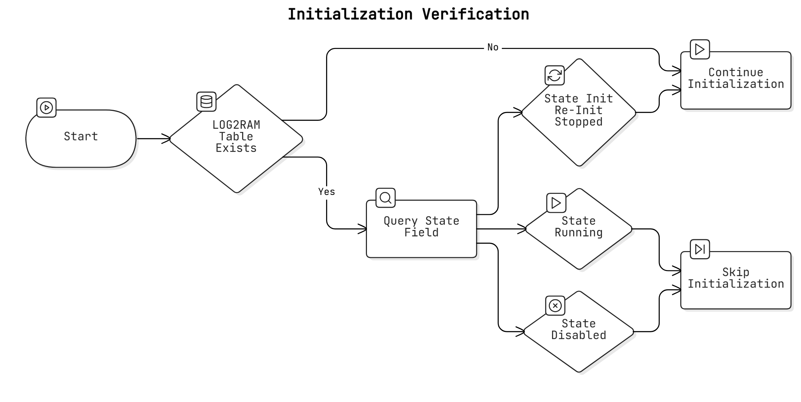
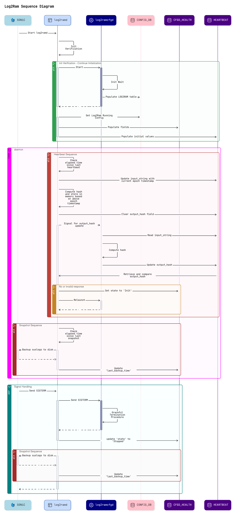

# High-Level Design for Log2Ram (Log2Ram)

### Rev 0.1

 | Rev |   Date    |     Author       | Change Description                |
 |:---:|:-----------:|:------------------:|-----------------------------------|
 | 0.1 |           |    Ashwin Srinivasan  | Initial version              |

### **1. Overview**

In Debian-based operating systems, logging is typically performed in the `/var/log` directory, which is conventionally mounted as a dedicated disk-based filesystem. Currently in SONiC, logging FS parameters varies based on platform and OS version: some platforms utilize RAM-based logging, while others rely on disk storage. The decision to mount `/var/log` on tmpfs is determined by the `union-mount` initramfs script which parses the kernel command line for the presence of the `logs_inram=on` parameter. This script is also responsible for executing the mounting operation.

Under the proposed design, the kernel command line check and the mounting logic will be decoupled from the `union-mount` script. These responsibilities will be transitioned to a dedicated daemon which would dynamically manage the `/var/log` filesystem, including its mounting type, and will support advanced configuration options such as filesystem size, synchronization frequency to disk and backup strategies. This design also aims to incorporate seamless integration with existing logging utilities (`rsyslog` and `logrotate`).


### 2. **Architecture and Workflow**

The functionality of the Log2Ram feature is proposed to be divided into two distinct components for improved modularity and maintainability:

- **Log2Ram Enforcer Daemon (`log2ramd`)**: Daemon that serves as a monitor -- maintains operational state, orchestrates required state transitions and enhances the robustness of `log2ramcfgd`

- **Log2Ram Config Daemon (`log2ramcfgd`)**: Responsible for managing the mounting of `/var/log` as a `tmpfs` filesystem, based on predefined configuration parameters.

Both daemons would live in the [sonic-host-services](https://github.com/sonic-net/sonic-host-services) repository as this is a host-level feature.


### 2.1 **Log2Ram Enforcer Daemon (`log2ramd`)**

#### 2.1.1 **Daemon Initialization**

1. **Initialization Verification**:  
  - Check for the presence of the `LOG2RAM` table in `STATE_DB`:  
    - If absent, this indicates a first-time initialization:  
      - Launch `log2ramcfgd` to manage the logging directory based on the provided configuration.
    - If the `LOG2RAM` table exists in `STATE_DB`:  
      - Query `state` field in `LOG2RAM|CFGD_HEALTH`:
        - If `state` is `Init`|`Re-Init`|`Stopped`, initialize `log2ramcfgd` as if it's the first-time setup.
        - If `state` is `Running`, skip further initialization steps.
        - If `state` is `Disabled`, skip further initialization steps and set member variable `log2ram_disabled` to `True`.
  - This is detailed in the flowchart below: <br><br>
  


2. **State and Configuration Setup**:  
  - Populate the `LOG2RAM` table in `STATE_DB` with the following keys and fields:

    - **Key: `CFGD_HEALTH`**: Tracks the state of `log2ramcfgd` with the following fields:
      - **`state`**: Indicates the daemon's operational status (`Init`, `Running`, `Re-Init`, `Disabled`, or `Stopped`):
        - `log2ramd` sets this to `Init` before launching `log2ramcfgd`.
        - `log2ramd` can set this to `Stopped` when gracefully terminating. 
        - `log2ramcfgd` can update this field to `Disabled` if the vendor does not require log2ram functionality enabled.
        - `log2ramcfgd` updates it to `Running` upon successful startup.
        - `log2ramcfgd` can update this field to `Re-Init` if user has pushed changes to the running configuration.
      - **`last_backup_time`**: Records the last timestamp of successful log backups.

    - **Key: `HEARTBEAT`**: Contains fields used for heartbeat validation:
      - **`input_string`**: Updated exclusively by `log2ramd` every 120 seconds with the current UNIX timestamp.
      - **`output_hash`**: Updated exclusively by `log2ramcfgd` with the hash derived from the `input_string`.


#### 2.1.2 **Daemon Workflow**


1. **Heartbeat Monitoring**:  
  - Periodically verify the health of `log2ramcfgd` using a heartbeat mechanism:  
    - If the elapsed time since the last heartbeat exceeds 120 seconds:  
      - `log2ramd` updates the `input_string` field with the current UNIX timestamp, computes its hash, and stores it in memory.
      - Clears the `output_hash` field and signals `log2ramcfgd` for a response.
      - `log2ramcfgd` reads `input_string`, computes its hash, and updates `output_hash`.
      - `log2ramd` retrieves and compares the `output_hash` with its in-memory value.
      - If no valid response is received within the timeout:  
        - Set `state` in `CFGD_HEALTH` to `Init`.
        - Relaunch `log2ramcfgd`. <br>

2. **Backup Management**:
  - Iff logging directory is mounted as `tmpfs`:
  - Periodically check the time elapsed since the last backup:  
    - If the elapsed time exceeds the configured sync interval, recurse through the logs directory and backup the archived files in to the designated location (e.g., `/var/tmp/log2ram`).
      - The backup strategy is explained in further detail in the next section.
    - Update the `last_backup_time` field in `LOG2RAM|CFGD_HEALTH` table in `STATE_DB`

In Parallel, the daemon is also responsible for **Signal Handling**:
  - Respond to OS-level signals such as `SIGTERM` during planned reboots or power cycles:
    - Query and parse the `state` field from `CFGD_HEALTH` table in `STATE_DB`. If value is not `Stopped` | `Disabled`:
      - Terminate `log2ramcfgd` using a `SIGTERM` signal.
    - Update `state` in `CFGD_HEALTH` to `Stopped`.
    - Perform a final backup of the `tmpfs` logs directory to a location on disk.
    - Gracefully terminate `log2ramd` itself.
    - Note that terminating `log2ramd` and `log2ramcfgd` will NOT unmount the logging directory or stop rsyslog service.
<br><br>
The sequence diagram for the `log2ramd` daemon to illustrate the workflow is shown:<br>



#### 2.1.2.1 **Backup Strategy**:

Backing up the logs directory to disk is an infrequent but essential process. To improve the retention of historical logs, we propose increasing the backup directory's size limit, allowing retrieval of older logs from the device spanning a longer time frame. To maximize efficiency, only the files currently being logrotated will be backed up to the disk:

```
/var/log/auth.log
/var/log/cron.log
/var/log/syslog
/var/log/teamd.log
/var/log/telemetry.log
/var/log/frr/bgpd.log
/var/log/frr/zebra.log
/var/log/swss/sairedis*.rec
/var/log/swss/swss*.rec
```

Key specifications for the backup system are as follows:
- The size limit of the backup directory will be set to **twice the size of the `tmpfs` logs directory**.
- The backup directory will exist as a simple folder on the root filesystem, rather than being mounted as a standalone filesystem.

### Backup Algorithm

The proposed backup algorithm includes the following steps:

1. **Assess Current Directory Sizes**
   - Calculate the total size of the existing backup directory and the archive files in the logs directory.

2. **Ensure Space Availability**
   - If the combined size of the backup and incoming archive files exceeds the defined space limit, delete the oldest archive files in the backup directory until sufficient space is available.

3. **Synchronize with `logrotate`**
   - Perform a `logrotate` operation on the logs directory prior to initiating the backup. This minimizes the risk of race condition where log files are rotated while being transferred.  

4. **Identify Archive Prefixes**
   - Recursively parse the logs directory to identify unique filename prefixes (e.g., `syslog`, `cron`, `sairedis`, `swss` etc.)

5. **Process and Transfer Archives**
   For each unique prefix:
   - **Determine File Count:** Calculate the number of new archive files in the logs directory requiring transfer to the backup directory, denoted as `N`.
   - **Adjust Indexing:** Increment the numeric indices of the existing archive files in the backup directory by `N`.
     - Example:
       - **Backup Directory content Before Increment:**
         `syslog.2.gz` to `syslog.12.gz`
       - **Logs Directory content after logrotate operation:**
         `syslog.2.gz` to `syslog.8.gz` -- 7 files in total.
       - **Backup Directory contents After Increment:**
         `syslog.9.gz` to `syslog.21.gz`
   - **Transfer Files:** Move all new archive files from the logs directory to the backup directory.
     - After transfer:
       - **Logs Directory:** No `syslog.*.gz` files remain.
       - **Backup Directory:** Contains `syslog.2.gz` to `syslog.21.gz`.


#### 2.1.3 **Log2Ram Class and APIs**

```
class Log2RamDaemon:
    def __init__(self):

        self.log2ram_disabled = True

        self.heartbeat_interval = 120
        self.heartbeat_timeout = 10s
        self.heartbeat_time_elapsed = 0
        self.heartbeat_hash = None

        self.last_backup_time = None
        self.backup_time_elapsed = 0


    def init_verification(self):
        """
        Verify initialization by checking the `LOG2RAM` table in `STATE_DB`; 
        if absent, launch `log2ramcfgd`, otherwise initialize or skip based on the `state` field.

        return: boolean to indicate whether to continue with initialization steps
        """

    def setup_state_and_config(self):
        """
        Populate the LOG2RAM table in STATE_DB with keys:
        CFGD_HEALTH to track log2ramcfgd state and 
        HEARTBEAT for heartbeat validation.
        
        return: N/A
        """

    def check_log2ram_table_presence(self):
        # Check for the presence of the LOG2RAM table in STATE_DB
        # Return: boolean - True if the table exists, False otherwise

    
    def check_log2ramcfgd_state(self):
        # Check state field in LOG2RAM|CFGD_HEALTH table in STATE_DB
        # Return: string - `state` value

    def launch_log2ramcfgd(self):
        # Launch log2ramcfgd daemon
        # Return: N/A

    def perform_heartbeat_hash(self):
        # Perform hashing operation on input_string and save the hash in memory (self.heartbeat_hash)
        # Return: N/A

    def request_heartbeat_response(self):
        """
        Signals log2ramcfgd for a response to a heartbeat request, 
        Waits until the response is received or timed out (10s)
        Verifies output_hash against computed heartbeat_hash
        
        Return: int - 0 if successful, 1 if invalid response, 2 if timeout
        """

    def monitor_heartbeat(self):
        # Verify the health of log2ramcfgd using a heartbeat mechanism
        # Return: N/A

    def manage_backups(self):
        # Check the time elapsed since the last backup and perform backup if necessary
        # Return: N/A

    def signal_handler(self):
        # Handle OS-level signals such as SIGTERM and SIGINT
        # Return: N/A

```
#### 2.2 **Log2Ram Config Daemon (`log2ramcfgd`)**

1. The Log2Ram Config Daemon (`log2ramcfgd`) manages the `/var/log` mount point based on user-defined parameters.

2. Key responsibilities are:
  + Mounting the logging directory per configuration parameters parsed from a platform-specific JSON file
  + Monitoring `CONFIG_DB` for configuration changes, validating updates, and remounting the logging directory as needed.

3. Configuration parameters are stored in a platform-specific JSON file (e.g., `log2ram-config.json`) located in `/usr/share/sonic/[platform]`, enabling vendors to fully control configuration settings.

4. The `log2ramcfgd` daemon is exclusively managed by the Enforcer Daemon (`log2ramd`), which handles its initialization, termination and recovery.


#### **2.2.1 Configuration Parameters**

The following user-configurable parameters are proposed:

- `enabled`: `true|false` - Boolean value indicating whether this feature is enabled on the current platform
- `mount_options`:
    - A list of string attributes to apply to the `/var/log` filesystem
    - In the event of invalid mount options, the error would be logged in the Log2Ram log file and default values should be applied as a fallback.
- `fs_size_pct`:
    - Size of the filesystem as a percent value of the total available RAM space on the platform
    - This parameter is dynamically calculated based on the RAM thresholds in Table 1, if absent in the config file.
    - **Safety Mechanism**: The tmpfs size is capped at 15% of total RAM if the vendor-configured value is greater.

    | RAM Tier           | Default Percentage |
    :-------------------:|:------------------:|
    | Very Low (<4 GB)   | 5%                 |
    | Low (4-8 GB)       | 7%                 |
    | Typical (8-16 GB)  | 8%                 |
    | High (16-32 GB)    | 9%                 |
    | Very High (>32 GB) | 10%                |
    <sub>Table 1</sub>

- `sync_interval`: Specifies the time in seconds to wait before backing up logging directory to a location on disk (e.g., `/var/tmp/log2ram/`). Default sync interval is 86400 seconds (1 day).

- **Example Config File**:
  ```json
  {
    "enabled": false,
    "mount_options": ["remount", "rw", "nodev", "nosuid", "relatime", "noexec"],
    "fs_size_pct": "7",
    "sync_interval": 86400
  }
  ```

#### 2.2.2 **Daemon Initialization**

1. Parse `/usr/share/sonic/$PLATFORM/log2ram/log2ram-config.json`if present, if not use default values<sup>**</sup> embedded in source code.
2. Validate configurations and use defaults for incorrectly configured parameters.
3. If `enabled` value in the parsed configuration is `false`
  - Mount the `/var/log` directory as a loopback filesystem with default mount options
  - Set the `state` field of `CFGD_HEALTH` table in STATE_DB to `Disabled`
  - Exit the `log2ramcfgd` daemon

4. Check if logging directory is already mounted as a filesystem:
  - If so, parse the mount options and other values of current running config fields on the host
  - Compare these parsed values with the proposed running config values deduced in the previous step.
    - If the values match, the logging filesystem is already mounted as intended. 
      - Set the `state` field in the `CFGD_HEALTH` table on the `STATE_DB` to `Running`
      - Skip the rest of the initialization.
    - Else, prepare the filesystem to be remounted with the new config values:
      - Stop `rsyslogd` service
      - Backup the logging directory to the designated backup directory on disk
      - unmount the logging directory filesystem
      - Now, continue with the initialization procedure

5. Else, continue with initialization procedure
6. Calculate tmpfs size dynamically based on system RAM thresholds if not present in the config file
7. Post the configuration parameters to the tentatively named  `LOG2RAM` table in `CONFIG_DB`
8. Mount `/var/log` to either RAM or Disk based on previously validated configuraton parameters.
9. Restore logs from disk and save to /var/log directory.
10. Start the rsyslog service
<br>

\*\*Note that log2ram is disabled by default, meaning that in the absence of the `log2ram-config.json` file, the feature stays disabled unless the appropriate changes are made to the `CONFIG_DB` either via CLI (recommended) or modifying `/etc/sonic/config_db.json` and calling `config reload` (not recommended).

In the event that the feature is disabled, the logging directory would be mounted to disk, with the mount options and filesystem size calculations done as with older SONiC versions.


### **2.2.3 Post-Initialization Workflow**

- The `log2ramcfgd` daemon starts a `CONFIG_DB` listener with a callback function that triggers on any changes to the `LOG2RAM` table.

- When the callback function is called, it performs the following steps:

  **1. Heartbeat Response:**
    - Retrieve and parse the value of the `input_string` field from the `LOG2RAM|HEARTBEAT` table in `STATE_DB`.
    - Compute the hash of the `input_string` and update the `output_hash` field in the `LOG2RAM|HEARTBEAT` table in `STATE_DB`.

  **2. Validate Config Changes:**
    - Validate the incoming configuration change request by:
      + Ensuring at least one value differs from the current configuration.
      + Verifying the validity of the new configuration values.
    - Iff both conditions are met:
      - Set the `state` field in the `CFGD_HEALTH` table in `STATE_DB` to `Re-Init`.
      - Run the initialization process for `log2ramcfgd`.

- **Signal Handling:**
  - In parallel, the daemon also handles OS-level signals such as SIGTERM and SIGINT:
    - Remove all fields within the `LOG2RAM` table.
    - Set the `state` field in the `CFGD_HEALTH` table in `STATE_DB` to `Stopped`.
    - Gracefully exit the daemon.

### **4. Runtime CLI**


### **5. Service Dependencies**

- **Systemd Integration**:
  - `log2ram.service` initializes Log2Ram before `rsyslogd`.
  - Updates to `rsyslog.service`:
    ```ini
    [Unit]
    After=log2ram.service
    Requires=log2ram.service
    ```  


### **7. Reboot and Shutdown Behavior**

- **Before Shutdown**:
  - Sync logs from RAM to disk into `/var/log-disk-backup`.
  - Ensure graceful shutdown to prevent data loss.

- **On Boot**:
  - Restore logs from `/var/log-disk-backup` into the tmpfs `/var/log`.
  - Validate configurations before proceeding.


### **8. Integration with Logrotate**

- Dynamically update log rotation policies to align with the tmpfs size.
- Ensure seamless operation if users adjust filesystem sizes or sync intervals.


### **9. Monitoring and Alerts**

- Monitor:
  - Tmpfs usage, syncing status, and errors.
  - Trigger alerts if filesystem usage exceeds 90%.

- Logging:
  - Log2Ram will log its actions to `/var/log/log2ram.log` (or directly to disk during initialization).
